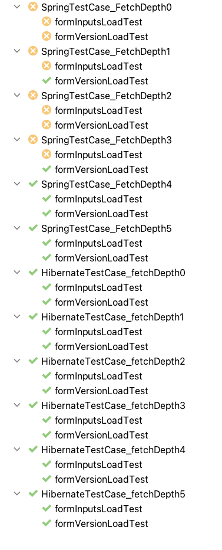

# Hibernate 6 Upgrade Issue with `max_fetch_depth` Parameter

## Outline
We use Spring Data JPA with Hibernate. We have recently upgraded to the following versions:

```
<spring.version>6.0.10</spring.version>
<spring-data-jpa.version>3.1.1</spring-data-jpa.version>
<hibernate.version>6.2.5.Final</hibernate.version>
```

After updating, we noted two issues related to the Hibernate `max_fetch_depth` parameter:

1. Depending on the value of `max_fetch_depth`, entity relationships defined on fetched entities as @ManyToOne and
@OneToMany were being set to **null** rather than initialised with a proxy. This appears to be a bug to us because there is no way 
to now distinguish between absent data and data that should be lazily loaded. This is demonstrated by the results of the following test cases:

   1. SpringTestCase_FetchDepth0.formInputsLoadTest
   2. SpringTestCase_FetchDepth0.formVersionLoadTest
   3. SpringTestCase_FetchDepth1.formInputsLoadTest
   4. SpringTestCase_FetchDepth2.formInputsLoadTest
   5. SpringTestCase_FetchDepth2.formVersionLoadTest
   6. SpringTestCase_FetchDepth3.formInputsLoadTest
    
   &nbsp;
   
   .. in all of these test cases, the formVersion fields or the formInputs fields on their respective entities should at least be
   lazily fetched, but never null.

&nbsp;
2. Different values for `max_fetch_depth` are producing incompletely populated results, as expected, but the way the results are populated does not
seem consistent as the value for `max_fetch_depth` changes. That is, an entity that _is_ returned when `max_fetch_depth=1` is _not_ returned when `max_fetch_depth=2`.
One might expect that as the fetch depth is increased, more entities should be fetched. This is illustrated by the following test cases:

    1. SpringTestCase_FetchDepth0.formVersionLoadTest <-- Form Versions are null, test fails
    2. SpringTestCase_FetchDepth1.formVersionLoadTest <-- Form Versions are populated, test passes
    5. SpringTestCase_FetchDepth2.formVersionLoadTest <-- Form Versions are null _again_, test fails
    6. SpringTestCase_FetchDepth3.formVersionLoadTest <-- Form Versions are populated _again_, test passes

In regard to both of these issues, they only manifest when we fetch data in a Spring context, where the persistence unit is managed by Spring. 
When we fetch data outside a Spring context - that is, using only Hibernate and an entity manager we instantiate directly - we do not observe these issues.

We therefore believe that the bug is possibly a function of how Spring Data JPA now integrates with Hibernate 6, rather than a bug with Hibernate itself.

## Entity Model
Our highly simplified Entity Model consists of the following:

    ┌───────┐      ┌────┐
    │Program│1────*│Step│1──┐
    └───────┘      └────┘   │
                            │1
               ┌────────────┴─────┐       ┌───────────┐
               │Step Configuration│1─────*│ FormOption│
               └──────────────────┘       └───────────┘
                                                1
                                                │
                                                │
                                                1
                                          ┌───────────┐       ┌────┐
                                          │FormVersion│*─────1│Form│
                                          └───────────┘       └────┘
                                                1
                                                │
                                                │
                                                *
                                           ┌─────────┐
                                           │FormInput│
                                           └─────────┘
    
Note that FormVersion entities have a composite primary key consisting of the Form ID and a version number.

## Test Cases
We created two abstract superclass tests which are subclassed six times each in order to test different values 
for the `max_fetch_depth` parameter:
1. `AbstractHibernateTestCase`, which works exclusively with Hibernate and creates an `EntityManger` instance directly.
2. `AbstractSpringTestCase`, which uses a Spring context to manage the Entity Manager and uses Spring Data JPA repositories.

In both cases, the two *TestCase classes create the same data - the entity model above is persisted and the Step object is fetched via its ID.
Two test are performed:
1. formVersionLoadTest, in which it checks that the `formVersion` field on the first FormOption returned is non-null (step.configuration.formOptions[0].formVersion).
2. formInputsLoadTest, in which it checks that the `inputs` field on the FormVersion entity is not null (step.configuration.formOptions[0].formVersion.inputs).

## Sample Test Results


## Running Locally
``mvn test`` should do it.

By default, it can be a little slow due to the debug messages in the log. To speed it up, tweak the logging config in `src/main/resources/logback.xml`:
```
    <root level="info"> <!-- changed from 'debug' -->
        <appender-ref ref="STDOUT" />
    </root>
```
